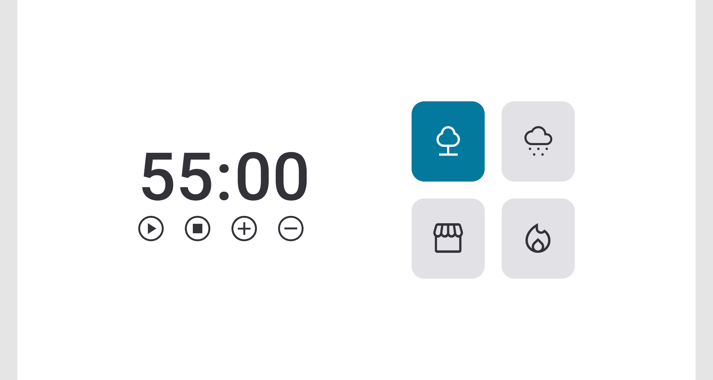

<h1 align="center"> FocusTimer 2.0 </h1>

Projeto proposto pela rocketseat no modulo sobre javascript, DOM.

  <a href="#-tecnologias">Tecnologias</a>&nbsp;&nbsp;&nbsp;|&nbsp;&nbsp;&nbsp;
  <a href="#-projeto">Projeto</a>&nbsp;&nbsp;&nbsp;|&nbsp;&nbsp;&nbsp;
  <a href="#memo-licença">Licença</a>

  

 

  

## 🚀 Tecnologias

Esse projeto foi desenvolvido com as seguintes tecnologias:

- HTML e CSS
- JavaScript
- DOM
- ES6

## 💻 Projeto

O timer 2.0 é um timer de estudos para o metodo pomodoro, podendo ser colocado a quantidade de minutos desejada e soara um alarme indicando que o timer acabou e esta na hora da pausa, alem disso possui som integrado, com audios ambiente para ajudar na concentração

## :memo: Licença

Esse projeto está sob a licença MIT.

---